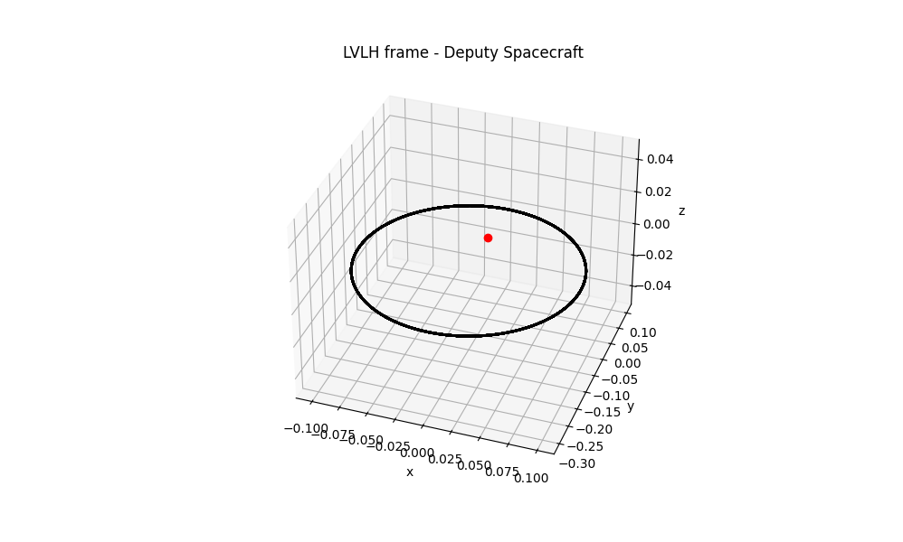
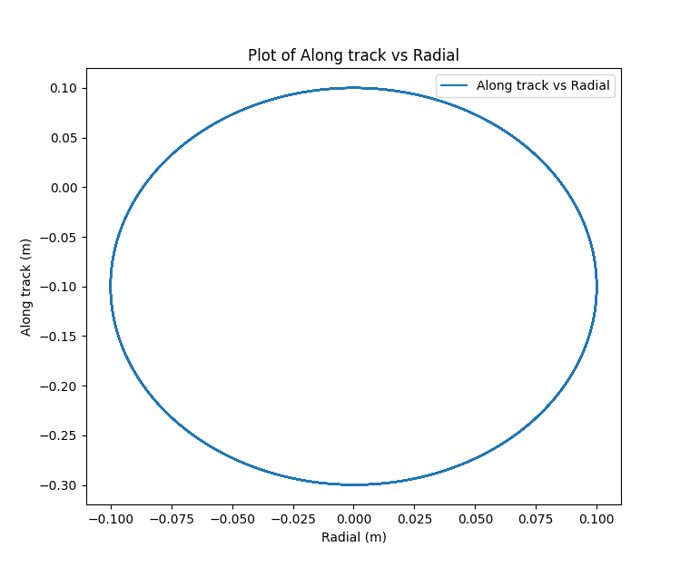
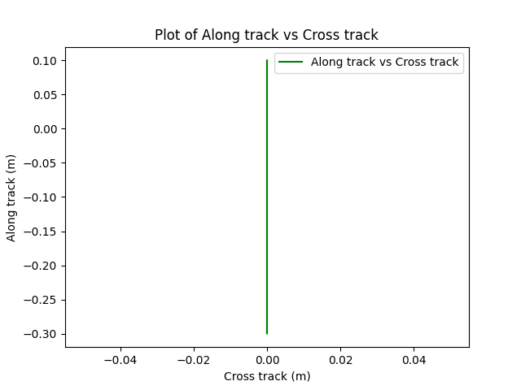
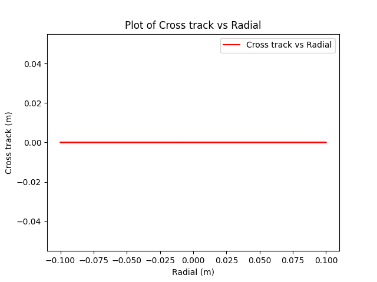

# 🚧 Repository Under Construction 🚧

**Note:** This repository is currently a work in progress. Some features may not be fully implemented, and there may be changes to the structure and functionality.

I have followed a paper format for this README area, this will be updated as we progress. As such, you may not be able to understand everything from scratch as the code is not written as finalized version. Once the project is finished, only the code that worked will be polished and provided here. Untill then, please use this repo with caution.

Thank you!

# Nanosat_FF_mission

This repository holds the code for the project aimed at developing guidance and control for nanosatellite formation flying mission aimed at space debris characterizating using aerodynamic force. In the following sections you will more details of the project starting from description, methodology, simulation results.

# Description of the project

Low earth orbit (LEO) and very low earth orbit(VLEO) are important regions for space-based applications like Earth observation, Telecommunication, and Astrophysics. Understanding and modeling the Space debris in this region is of utmost importance for space situational awareness. Specifically, due to the limitations of ground-based sensor systems, the detection and characterization of sub-millimeter-level objects require an in-situ sensor system. In these regions, the effect of aerodynamic force is significant, as a result, utilization of this force for position control is very attractive, especially for nanosats. This will enable nanosats not to carry propulsion system leading to increased available size, weight, and power (SWAP) for mission outputs such as science data by increasing the payload quality and mission redundancy via extra sensors and actuators.

In this work, we are proposing a guidance and control methodology for a novel aerodynamics-based nanosat formation flying mission. As the size and shape of the debris are not known a priori, the multi-static synthetic aperture radar (MSSAR) technique is considered to detect and characterize the sub-centimeter debris particles.

# Methodology

### Relative orbital dynamics with J2 pertubation in nearly non singular orbital element representation

Due to simplicity and its capabilities to represent orbits with arbitrary eccentricity, nearly non singular elements are used [3]. Specifically, we are making use of mean nearly non singular orbital elements [9] - this choice is supported by the fact that these elements only take into account the secular effects and therefore nullifying these effects will be an important part of keeping the formation configuration bounded.

Furthermore, with the introduction of parameters that can be used to geometrically define the formation flying [1], we can design formation flying configurations according to our needs.

## Design Parameters for Formation Flying

Based on **Sengupta and Vadali (2007)** [1] - _"Relative Motion and the Geometry of Formations in Keplerian Elliptic Orbits"_:

Here is an example of projected elliptical orbit. By using design parameters we can specify in which way our formation flying configuration should be.

| Parameter                       | Symbol        | Value                 | Description                                     |
| ------------------------------- | ------------- | --------------------- | ----------------------------------------------- |
| Radial Separation               | ρ<sub>1</sub> | 0.1 m                 | Separation along the radial axis                |
| Cross-Track Separation          | ρ<sub>3</sub> | 0 m                   | Separation along the cross-track axis           |
| Radial and Along-Track Angle    | α             | 0 rad                 | Angle between radial and along-track separation |
| Radial and Cross-Track Angle    | β             | π/2 rad               | Angle between radial and cross-track separation |
| Drift per Revolution            | v<sub>d</sub> | 0.000 m               | Drift per orbital revolution                    |
| Along-Track Separation          | d             | -0.1 m                | Separation along the orbital track              |
| Adjusted Along-Track Separation | ρ<sub>2</sub> | (2 η² d) / (3 - η²) m | Based on η                                      |

### Formation Geometry



### Figure 1: Along track vs Radial



### Figure 2: Along track vs Cross track



### Figure 3: Cross track vs Radial



## Optimization:

Non-linear optimization problem is being setup in the Casadi framework, currently the work is uderway to find the best possible solution to the problem at hand. You will find information on multiple shooting setup that solves the problem of moving satellites from initial FF configuration to final FF configuration by running "Multiple_shooting_setup.py", once the solver converges, you can visualize the solution with "Optimizer_solution_plots.py".

As a next step, We are planning to have a time optimized formation maintainance manuever and include this non-linear optimization step whenever the baseline requirements is not satifies. This way, we are maintaining the formation required for the radar sensing.

## Aerodynamic Forces Calculation

For our project, as we are considering VLEO region, aerodynamic forces like drag and lift are key to the dynamics of nanosatellites. These forces can be calculated using models suited for rarefied environments, such as the Modified Sentman Model. This model considers drag and lift coefficients, which describe the aerodynamic forces acting on satellite surfaces.

Drag Force: The drag force opposes the satellite’s motion and is determined by the atmospheric density, the satellite’s drag coefficient and cross-sectional area, and the relative velocity between the satellite and atmosphere.

Lift Force: The lift force acts perpendicular to the drag and depends on similar factors, including the lift coefficient and the orientation of the satellite relative to its velocity.

The Modified Sentman Model (detailed information can be found in [8] and [7]) is used to calculate these coefficients in VLEO, accounting for interactions between atmospheric particles and satellite surfaces. This approach models each cube face of a satellite as a flat plate and calculates the lift and drag coefficients based on the orientation and relative velocity of the satellite.

These aerodynamic force calculations are essential for accurately modeling and controlling satellite behavior in low-density, free molecular flow environments like VLEO.

# Repo directory structure

```markdown
├── core
├── Testing
├── README.md
└── .gitignore
```

- **core** contains the functions and details related to core part of project that includes attitude dynamics models, kinematics, translation dynamics, etc.
- **Testing** contains the files for testing - for example integration of different dynamics model.

# Simulation

- Entire dynamics integration can be seen by running IVP_scipy.py present inside Testing folder. Basically we are integrating 14 dimensional state vector with zero control input. Essentially a open loop intgration procedure. I will update this section as soon as we have more results. I assume that you install minimum required packages (run pip install -r requirement.txt before running the script) to run the script.

# References

## References

1. **Sengupta, P., and Vadali, S. R. (2007)**  
   _Relative Motion and the Geometry of Formations in Keplerian Elliptic Orbits with Arbitrary Eccentricity_.  
   _DOI:_ [10.2514/1.25941](https://doi.org/10.2514/1.25941)

2. **Traub, C., Fasoulas, S., and Herdrich, G. (2022)**  
   _A Planning Tool for Optimal Three-Dimensional Formation Flight Maneuvers of Satellites in VLEO Using Aerodynamic Lift and Drag via Yaw Angle Deviations_.  
   _DOI:_ [10.1016/J.ACTAASTRO.2022.04.010](https://doi.org/10.1016/J.ACTAASTRO.2022.04.010)

3. **Roscoe, C. W. T., Westphal, J. J., Griesbach, J. D., and Schaub, H. (2015)**  
   _Formation Establishment and Reconfiguration Using Differential Elements in J2-Perturbed Orbits_.  
   _Journal:_ Journal of Guidance Control and Dynamics  
   _DOI:_ [10.2514/1.G000999](https://doi.org/10.2514/1.G000999)

4. **Curtis, Howard D. (2020)**  
   _Orbital Mechanics for Engineering Students: Revised Reprint_.  
   _Publisher:_ Butterworth-Heinemann

5. **Schaub, H., and Junkins, J. L. (2018)**  
   _Analytical Mechanics of Space Systems_.  
   _Publisher:_ American Institute of Aeronautics and Astronautics, Incorporated

6. **Vallado, D. A. (2001)**  
   _Fundamentals of Astrodynamics and Applications, 4th ed._  
   _Series:_ Space Technology Library

7. **Traub, C., Herdrich, G., and Fasoulas, S. (2020)**  
   _Influence of Energy Accommodation on a Robust Spacecraft Rendezvous Maneuver Using Differential Aerodynamic Forces_.  
   _Journal:_ CEAS Space Journal, vol. 12, pp. 43–63. Springer

8. **Sentman, L. H. (1961)**  
   _Free Molecule Flow Theory and Its Application to the Determination of Aerodynamic Forces_.  
   _Publisher:_ Lockheed Missiles & Space Company, a Division of Lockheed Aircraft Corporation

9. **Schaub, H., Vadali, S. R., Junkins, J. L., and Alfriend, K. T. (2000)**  
   _Spacecraft Formation Flying Control Using Mean Orbit Elements_.  
   _Journal:_ The Journal of the Astronautical Sciences, vol. 48, pp. 69–87. Springer
